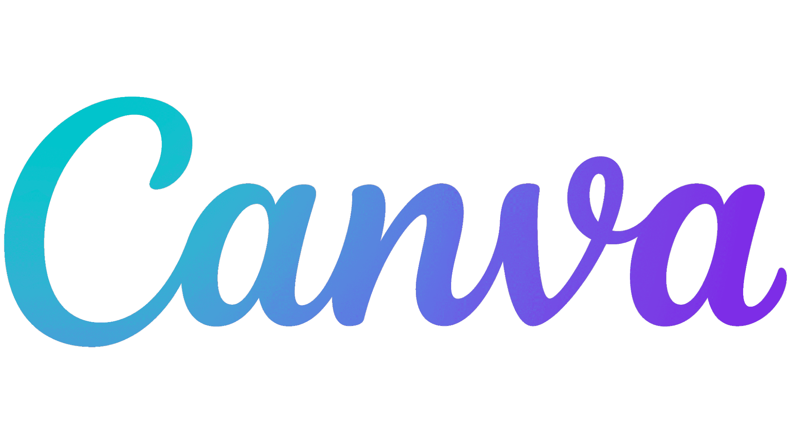
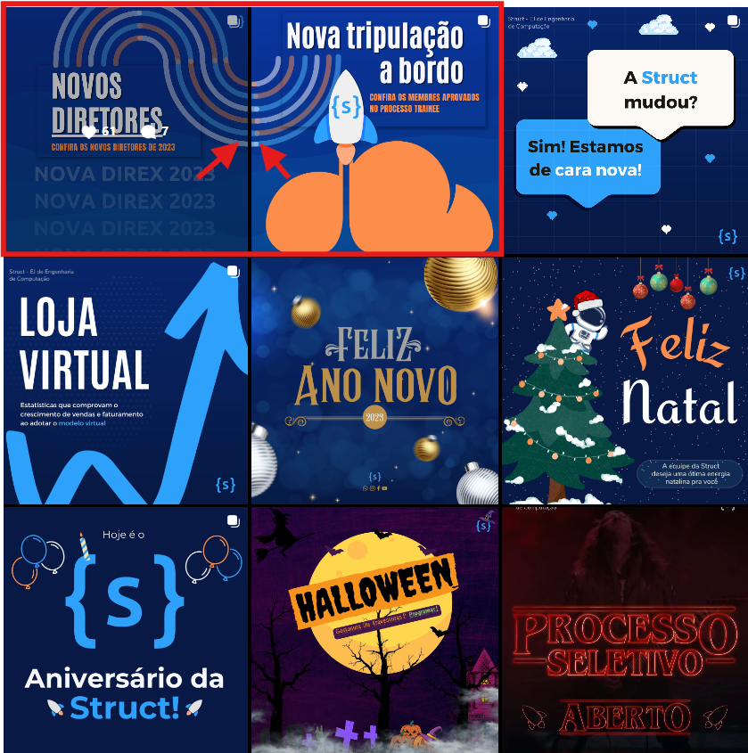
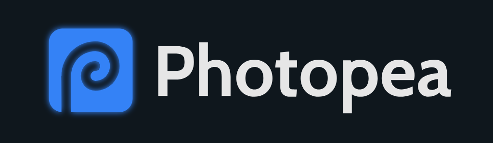
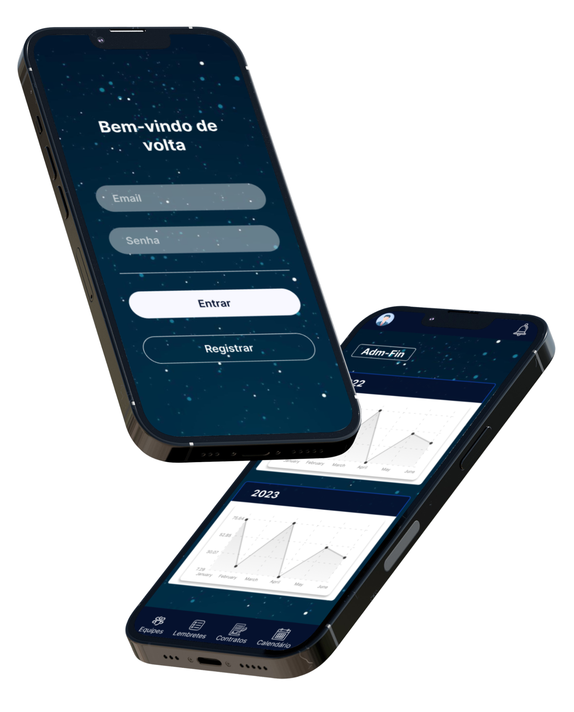

# Design

Esta documentação visa mostrar as tarefas primordiais de como trabalhar no cargo de Design e as ferramentas que utilizamos. 

# Canva

Para criar ilustrações, postagens para redes sociais, apresentações e afins utilizamos o Canva. Canva é uma ferramenta de design bem intuitiva que possui milhares de modelos e elementos gráficos.

### Planejamento de postagens

Além de criar nossos designs, no canva também fazemos os planejamentos de postagens.
Manter um planejamento de postagens é extremamente importante para manter o instagram da Struct de forma organizada e sem “buracos”.

No vídeo abaixo você pode entender como fazemos um planejamento de postagens.

https://youtu.be/URLCMt6aqHg

Site usado para separar a paleta de cores: https://pinetools.com/split-image

### Como fazer um post carrossel ou posts que se conectam:

Um estilo bem interessante de posts é o post carrossel, você pode observar isso nas postagens abaixo:

Nesse vídeo você pode entender como fazemos esse tipo de post.

https://youtu.be/zbbwguAiJoo

Site usado para separar os posts: https://pinetools.com/split-image

# Photopea

Photopea, o rival online e gratuito do Photoshop. 
O Photopea é uma aplicação online que oferece aos usuários a possibilidade de editar imagens usando uma grande diversidade de opções de edição totalmente de graça, a desvantagem disso é que por o Photopea ser gratuito, contém anuncios, mas nada que atrapalhe o desenvolvimento.

### Mockups

Aqui no Marketing da Struct, geralmente utilizamos o photopea para fazer postagens mais elaboradas, por exemplo inserir uma imagem em um mockup cuja no Canva, não seria possível.

Neste vídeo você pode entender como foi feito esse mockup na imagem a seguir:

https://youtu.be/m9xDtzvmcZQ

Link de vários mockups (obs: digite o tipo de dispositivo na pesquisa do site): https://unblast.com/mockups/

# Asana

Para gerenciamento e organização tarefas, lembretes de aniversariantes e planejamento de marketing interno utilizamos o Asana

Na versão gratuita do Asana, podemos ter 10 colegas de equipe, projetos e tarefas ilimitadas.

