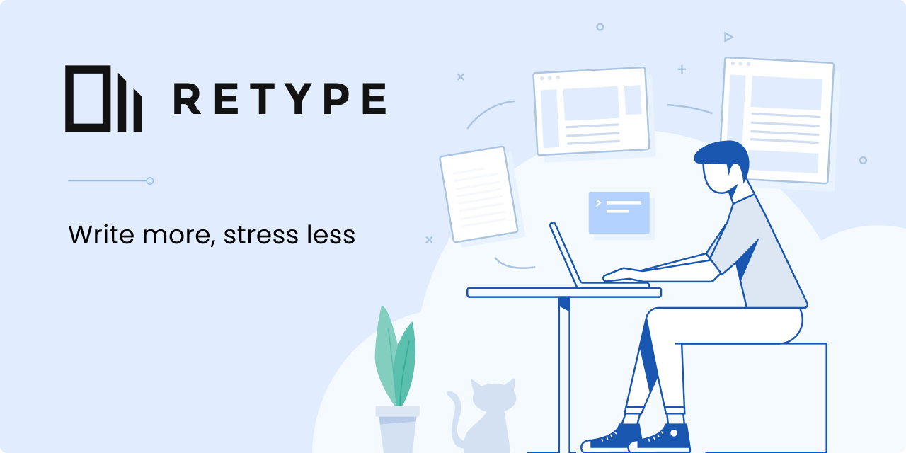
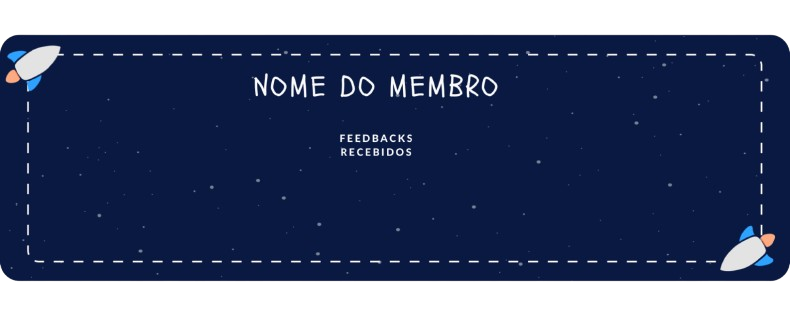

# Newsletter da Struct

## O que é a Newsletter?

A Newsletter é o nosso portal exclusivo para manter todos os membros da Struct informados sobre os eventos e as transformações que ocorrem na empresa. Publicada a cada dois meses, a Newsletter é um jornal bimestral que se destaca por fornecer uma visão abrangente sobre as principais atividades e mudanças dentro da organização.

## Periodicidade e Distribuição

A cada dois meses, uma nova edição da Newsletter é apresentada durante as Reuniões Gerais (RGs) e enviada a todos os meios de comunicação possíveis, incluindo Slack, WhatsApp e Discord. Isso garante que todos tenham acesso às informações de maneira conveniente e eficiente.

## Estrutura da Newsletter

### 1. Abertura:

- Título: "Xª Edição, Mês + Mês de 20XX"
- Mensagem de boas-vindas: "Nesta edição da Newsletter, você perceberá que estamos recheados de novidades, explore abaixo as principais novidades desde a 2ª edição da Newsletter."

### 2. Acontecimentos Bimestrais:

- Seção dedicada a destacar os acontecimentos mais relevantes dos últimos dois meses, incluindo conquistas, eventos memoráveis e desafios superados.

### 3. Atualizações de Diretorias:

- Nesta seção, você encontra informações sobre mudanças e inovações nas diretorias, além de atualizações sobre projetos em andamento e feedbacks recebidos de membros.

### 4. Espaço de Convivência:

- Um espaço colaborativo para análises de séries, animes, filmes e outros conteúdos culturais. Membros podem enviar suas contribuições através de um formulário, e em cada edição, pelo menos um conteúdo dessa seção é incluído.

## Configuração e Dependências para Uso do Retype

Para trabalhar na Newsletter utilizando o Retype, é necessário que algumas dependências estejam instaladas no seu ambiente de trabalho. As dependências incluem:

- nvm (Node Version Manager) [!embed](https://youtu.be/XlcHff3khcI?si=ZF40MRXZbQlnHBq0)
- Git LINUX- [!embed](https://youtu.be/O6nZ1RbXuQA?si=KMPQyjjhAw0gmOwN)  WINDOWS - [!embed](https://youtu.be/RLx63VZ9wSc?si=DmhCHp-rQntyRXRH)
- Retype

## Como Trabalhar na Newsletter

Aqui estão os passos para configurar o ambiente e começar a trabalhar na Newsletter:

### Clone o Projeto

- Utilize o Git para clonar o repositório do projeto para sua máquina local.

``` Comando: 
git clone <URL-do-repositório>
```
### Instale o Retype

- Após clonar o projeto, é necessário instalar o Retype. Existem várias maneiras de fazer isso, dependendo da ferramenta de gerenciamento de pacotes que você prefere.

``` Usando npm:
npm install retypeapp --global
```
``` Usando yarn:
yarn global add retypeapp
```
``` Usando dotnet:
dotnet tool install retypeapp --global
```



## O que é o Retype?

O **Retype** é uma ferramenta poderosa que permite gerar sites estáticos a partir de arquivos Markdown. É uma solução ideal para criar documentações, blogs ou qualquer tipo de conteúdo que necessite de uma estrutura leve e rápida de desenvolvimento. Com o Retype, você pode transformar rapidamente seus arquivos Markdown em um site moderno e responsivo, sem precisar se preocupar com configurações complexas.

### Principais Características:

- **Geração Rápida:** Converte automaticamente seus arquivos Markdown em páginas HTML elegantes e navegáveis.
- **Fácil de Usar:** Com uma instalação simples e comandos intuitivos, você pode começar a construir seu site em minutos.
- **Customização:** Oferece opções de personalização para adequar o design do site ao seu estilo ou às necessidades da sua organização.

#### Como Fazer os Títulos?

No Retype, os títulos são criados usando a sintaxe Markdown padrão:

``` Título de Nível 1 (H1):
# Título Principal
```
``` Título de Nível 2 (H2):
## Subtítulo
```
``` Título de Nível 3 (H3):
### Seção
```
E assim por diante, até o Nível 6 (H6). A estrutura hierárquica dos títulos ajuda a organizar o conteúdo da página, facilitando a navegação e a leitura.

### Usando CSS no Retype

O Retype permite a customização de estilos através de CSS, oferecendo flexibilidade para ajustar o design das páginas conforme suas necessidades. Aqui está como você pode incorporar CSS e ajustar o tamanho das imagens:

#### Incorporando CSS:

Você pode adicionar CSS diretamente em um arquivo Markdown utilizando a tag < style >, ou criar um arquivo CSS separado e referenciá-lo no seu projeto

- Exemplo de CSS Inline:

``` html html
<style>
.custom-title {
  color: #3498db;
  font-size: 2rem;
  text-align: center;
}

.custom-image {
  width: 50%;
  height: auto;
}
</style>

# Título Customizado {.custom-title}

{.custom-image}
```
Neste exemplo, a classe custom-title é aplicada ao título, e custom-image é usada para ajustar o tamanho da imagem.

#### Ajustando o Tamanho das Imagens:

Para ajustar o tamanho das imagens diretamente no Markdown, você pode usar a sintaxe de classes CSS:

- Exemplo de Redimensionamento de Imagem:

```markdown markdown
{.custom-image}
```
- E, no seu CSS:

```css css
.custom-image {
  width: 300px; /* Largura fixa */
  max-width: 100%; /* Respeita a largura máxima do contêiner */
  height: auto; /* Mantém a proporção da imagem */
}
```
Esse código ajusta a imagem para uma largura fixa de 300 pixels, mantendo a proporção original.

Para mais detalhes sobre como utilizar o Retype, acesse a documentação oficial:

[!ref target="blank" text="Documentação Retype"](https://retype.com/)

## Padronização de Branch e Desenvolvimento

Para garantir consistência e organização no desenvolvimento da Newsletter, seguimos uma padronização tanto na nomenclatura das branches quanto na estrutura de desenvolvimento.

### 1. Padronização de Branch

Todas as branches criadas para o desenvolvimento de uma nova edição da Newsletter seguem um padrão específico. Esse padrão ajuda a identificar rapidamente a edição e o ano correspondente.

   - **Exemplo de Branch:** terceira_edição_2024
       - **Formato:** < número_da_edição>_edição_< ano>
       - **Mudança:** Apenas o número da edição e o ano são atualizados conforme necessário.

Essa padronização facilita o rastreamento do progresso de diferentes edições e mantém a organização do repositório.

### 2. Padronização no Desenvolvimento

Para manter a consistência no desenvolvimento da Newsletter, é importante seguir os padrões estabelecidos nas edições anteriores. Você pode observar as práticas adotadas nas newsletters antigas para garantir que a estrutura, formatação e estilo sejam mantidos.

   - **Referência:** As edições antigas servem como guia para novas implementações. Isso inclui a forma como o conteúdo é estruturado, o uso de componentes, e qualquer personalização específica que foi aplicada.

Essa abordagem padronizada assegura que todas as edições da Newsletter tenham um visual e funcionamento coesos, facilitando tanto a leitura quanto a manutenção.

## Coleta de Informações para a Newsletter

Para garantir que a Newsletter da Struct esteja sempre atualizada e reflita com precisão o que está acontecendo na empresa, seguimos um processo estruturado de coleta de informações. Aqui estão os detalhes de como essas informações são coletadas:

### 1. Informações das Diretorias e Squads

As informações sobre o progresso, mudanças e novidades nas diretorias e squads são coletadas de maneira sistemática:

   - **Forms de Coleta:** A cada edição da Newsletter, é enviado um formulário específico para cada diretor ou representante de squad. Eles são responsáveis por preencher o formulário com as atualizações e informações relevantes de suas respectivas áreas. Isso garante que todas as diretorias e squads tenham a oportunidade de compartilhar suas conquistas, desafios e atividades em andamento, mantendo a comunicação interna transparente e completa.

### 2. Feedbacks e Eventos

Para eventos e outras atividades significativas dentro da empresa:

   - **Feedback Direto:** Quando ocorre um evento ou atividade relevante, o responsável pelo evento, seja um diretor ou outro membro da equipe, fornece um feedback detalhado sobre o ocorrido. Este feedback é então incluído na seção correspondente da Newsletter. Essa abordagem permite que a Newsletter reflita não apenas o ponto de vista dos gestores, mas também as percepções e aprendizagens obtidas durante os eventos.

### 3. Espaço de Convivência

O Espaço de Convivência é uma seção especial da Newsletter que permite que os membros compartilhem conteúdos sobre qualquer assunto de interesse, incluindo animes, filmes, séries, e outros temas diversificados.

   - **Formulário de Submissão:** Assim como as diretorias, os membros podem enviar suas contribuições para o Espaço de Convivência através de um formulário específico. Esse formulário permite que os membros se expressem livremente, compartilhando suas opiniões e sugestões sobre uma variedade de tópicos. O uso do formulário facilita a coleta e organização dos conteúdos, garantindo que cada edição da Newsletter contenha material diversificado e envolvente.

### 4. Coleta de Feedback

Para garantir que a Newsletter da Struct esteja sempre alinhada com as expectativas dos membros e reflita as experiências e opiniões deles, realizamos a coleta de feedback de maneira estruturada:

   - **Formulário de Feedback:** A coleta de feedback dos membros é realizada por meio de um formulário específico. Esse formulário é enviado periodicamente para que os membros possam compartilhar suas opiniões, sugestões e críticas sobre a Newsletter e outras atividades da empresa. O feedback coletado é essencial para ajustar o conteúdo, a estrutura e a abordagem da Newsletter, garantindo que ela continue sendo um recurso valioso para todos na Struct.
  
  - **Cards de Feedback:** Além do formulário, também utilizamos cards de feedback para apresentar os resultados de maneira visual e acessível. Esses cards são criados no Canva, uma ferramenta de design gráfico online que permite criar visuais atrativos e profissionais. Os cards ajudam a sintetizar as principais observações e sugestões recebidas, facilitando a análise e a aplicação das melhorias necessárias.

**Estrutura do card:**



# DOCSTRUCT

## Finalidade do DOCSTRUCT

O DOCSTRUCT é a ferramenta central utilizada para documentar todos os aspectos da empresa. Ele serve como o repositório principal de informações, onde todas as políticas, procedimentos, processos, e conhecimentos institucionais são armazenados e organizados de forma acessível.

### Principais Objetivos do DOCSTRUCT:

   - **Centralização das Informações:** Reunir em um único local todas as documentações relevantes da empresa, facilitando o acesso e a consulta por parte de todos os membros.
   - **Padronização:** Assegurar que todas as informações sejam documentadas de forma consistente, utilizando os mesmos padrões e formatos, o que ajuda a manter a clareza e a uniformidade.
   - **Facilidade de Atualização:** Permitir que a documentação seja facilmente atualizada e mantida, refletindo as mudanças e evoluções contínuas dentro da empresa.
   - **Transparência e Acessibilidade:** Garantir que todas as áreas da empresa tenham acesso às informações necessárias para desempenhar suas funções de forma eficaz.

Este guia fornece instruções detalhadas sobre como clonar o repositório, configurar o ambiente de desenvolvimento e contribuir para a documentação do DOCSTRUCT.

### 1. Clonando o Repositório

Primeiro, clone o repositório do DOCSTRUCT para sua máquina local usando Git:

``` Comando: 
git clone <URL-do-repositório>
```

### 2. Instalação de Dependências

Para trabalhar com o DOCSTRUCT, é necessário ter algumas dependências instaladas:

   - nvm (Node Version Manager)
   - Git
   - Retype

Certifique-se de seguir os mesmos passos de instalação descritos anteriormente (na seção da newsletter).

### 3. Rodando o Projeto

Após clonar o repositório e instalar as dependências, você pode começar a trabalhar na documentação. A documentação está dividida em quatro seções principais, cada uma representada por uma pasta na raiz do repositório:

   - **ferramentas-de-ambiente**
   - **organizacao-interna**
   - **stack**
   - **squads**

Cada uma dessas seções é um projeto separado do Retype. Para rodar o projeto de uma seção específica, siga os passos abaixo:

``` Navegue até a pasta desejada:
cd organizacao-interna
```

``` Inicie o projeto do Retype:
retype start
```
Com o projeto rodando, você pode começar a escrever sua documentação em arquivos Markdown, utilizando os componentes e padrões do Retype. Para dúvidas sobre como escrever a documentação, consulte a documentação do Retype.

[!ref target="blank" text="Documentação Retype"](https://retype.com/)

## Como se Organizar no Projeto

### Criação de Branches

Para adicionar ou modificar conteúdo na documentação, siga as convenções de nomenclatura de branches:

#### Funcionalidade (Feature):

   - Para adicionar novas seções ou conteúdo, crie uma branch começando com feat/.
   
``` Exemplo:**
feat/deploy-projetos
```

#### Correção (Fix):

   - Para correções na documentação existente, use fix/.

``` Exemplo:**
fix/typescript
```

### Pull Requests (PR)

Após concluir suas alterações, crie uma Pull Request (PR) no GitHub com o nome da sua branch.

#### Descrição da PR:

   - Explique detalhadamente o que foi feito ou corrigido.
   - Mencione o que faltou ser feito e os motivos, se houverem.
   - Sugerir possíveis melhorias.

#### Revisão e Merge:
   - Solicite a revisão da sua PR por um colega de confiança.
   - Após as revisões e correções necessárias, peça para o revisor aplicar o Merge.

## Como é Feita a Documentação?

A criação e a manutenção da documentação no DOCSTRUCT geralmente seguem um fluxo colaborativo, envolvendo tanto gerentes quanto membros da equipe.

### 1. Responsabilidade pela Documentação

   - **Gerente do Cargo:** Em muitos casos, o gerente responsável pela área ou cargo específico é quem cria a documentação inicial. Este gerente possui o conhecimento detalhado necessário para garantir que as informações sejam precisas e completas.
   - **Membro da Equipe:** Após a criação da documentação pelo gerente, um membro da equipe pode ser encarregado de transferir essas informações para o DOCSTRUCT, utilizando as ferramentas e padrões estabelecidos.
   - **Gerente Faz Ambos:** Em alguns casos, o gerente pode optar por realizar ambas as tarefas — tanto criar a documentação quanto transferi-la para o DOCSTRUCT. A escolha entre essas abordagens depende da dinâmica da equipe e da disponibilidade dos membros.

### 2. Como Colocar a Documentação no DOCSTRUCT

Para inserir a documentação no **DOCSTRUCT**, siga estas diretrizes:

   - **Basear-se nas Documentações Anteriores:** Utilize as documentações já existentes como referência. Isso garante que você siga o estilo e os padrões já estabelecidos, mantendo a coesão em todo o conteúdo do DOCSTRUCT.
   - **Padrões de Formatação:** Mantenha a consistência com as práticas anteriores em termos de estrutura de títulos, formatação de texto, e organização do conteúdo.
   - **Técnicas Semelhantes à Newsletter:** O processo técnico de inserção da documentação no DOCSTRUCT é similar ao utilizado para a Newsletter. Utilize os mesmos comandos, ferramentas e fluxo de trabalho descritos na seção anterior.
