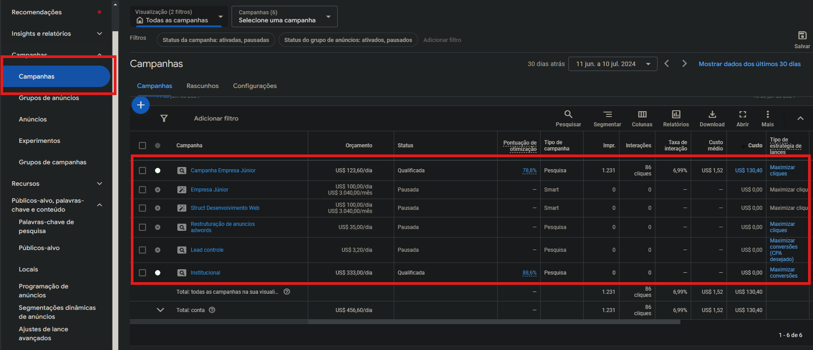
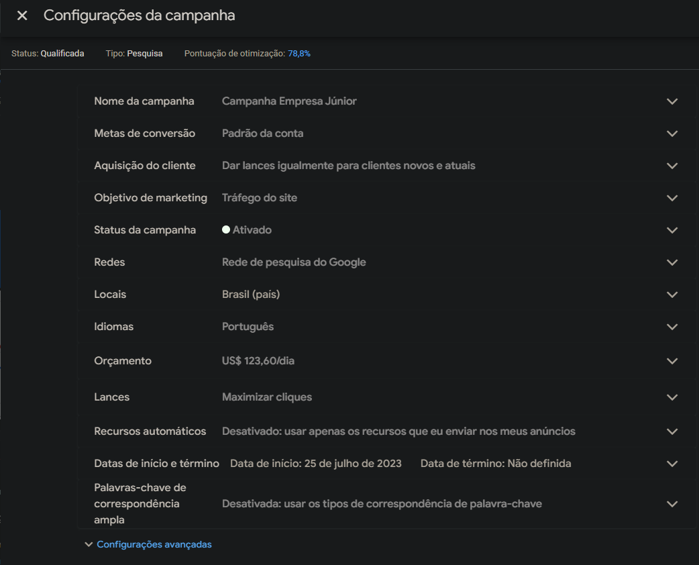
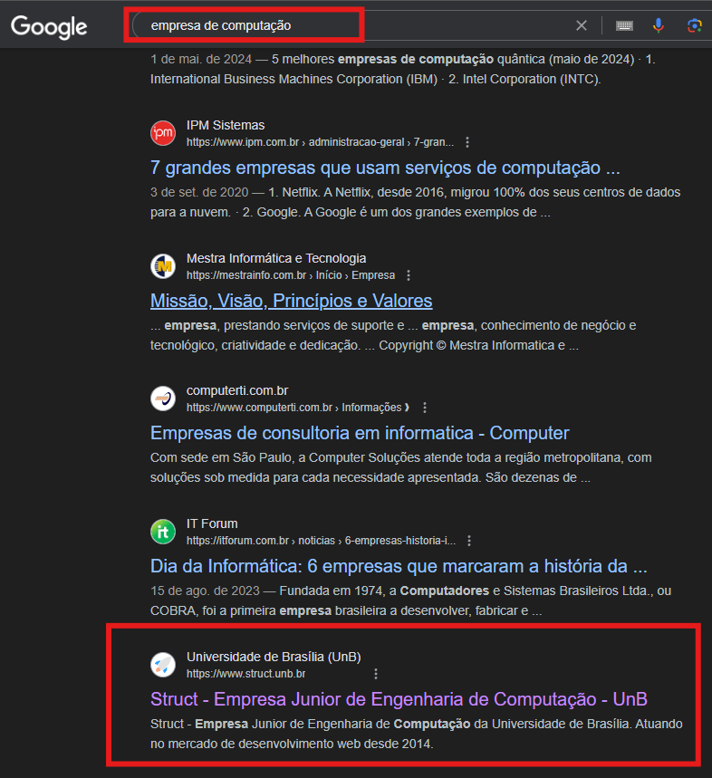
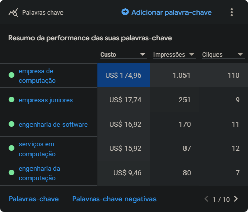
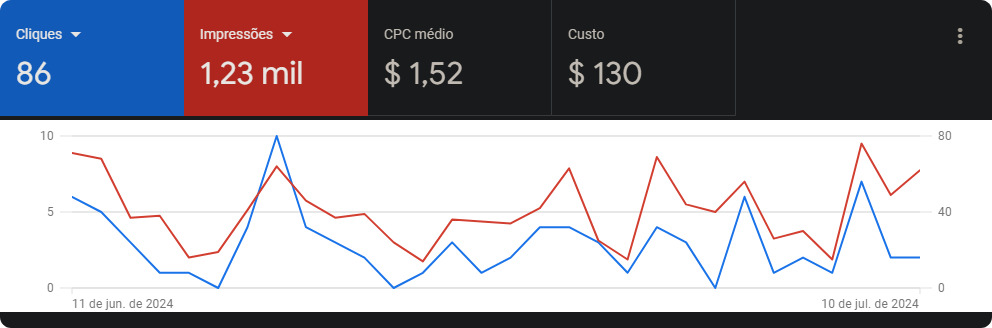
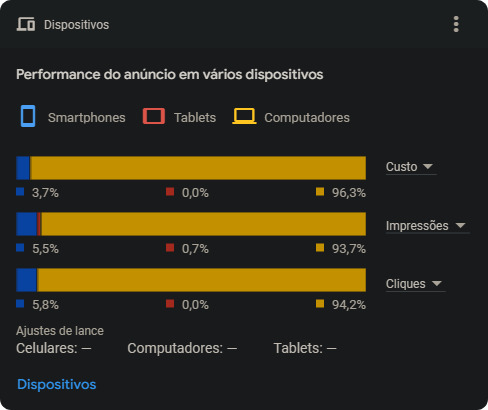
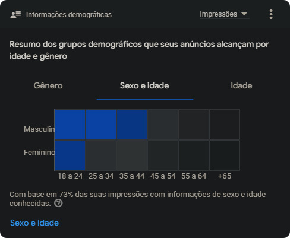

# Google Ads

## O que é o Google Ads? 

Google Ads é uma plataforma de gerenciamento de anúncios que permite que nossa empresa e seus serviços apareçam quando alguém pesquisa no Google. Com Google Ads, os anúncios são constantemente otimizados para alcançar o público certo no momento certo, aumentando a visibilidade e atraindo clientes potenciais. Além disso, a plataforma oferece diversas ferramentas para criar, gerenciar e analisar campanhas de publicidade, permitindo ajustar estratégias e maximizar o retorno sobre o investimento. É a ferramenta ideal para a gente que quer  aumentar a presença online e atingir seus objetivos de marketing de forma eficaz.

### Objetivos de um anúncio:

- **Vendas:** vender
- **Leads:** gerar cadastro
- **Tráfego no Website:** gerar acessos no site
- **Notoriedade e ponderação:** levar conteúdo para as pessoas
- **Promoções de App:** divulgar aplicativos
- **Promoções e visitas a lojas físicas:** visitas a lojas

### Tipos de campanha é segmentação indicadas

- **Pesquisa:** Palavras-chave
- **Rede de display:** Principalmente público quente
- **Shopping:** Atinge novamente quem já interagiu com a sua loja online (Precisa de uma conta no Marchard Center).
- **Vídeo:** Públicos-alto, palavras-chave, tópicos, e canais
- **App:** Divulgar seu aplicativo

## Como um gerente de publicidade, anúncio de SEO vai atuar neste cargo?

### Gerenciar Campanhas

Um perfil no Google Ads é constituído por campanhas, atualmente temos essas campanhas:

Cada campanha tem seu objetivo e também cada campanha pode ser pausada ou retomar campanha, por exemplo, a campanha “Campanha Empresa Júnior” que inclusive é a campanha que vem sendo utilizada há anos está configurada do seguinte modelo:

Então você deverá gerenciar campanhas, pausar campanhas que não estão dando certo, retomar campanhas necessárias ou até mesmo criar campanhas para qualquer objetivo.

### Monitoramento das palavras chaves

Palavras chaves é a chave que será encontrada no nosso site, por exemplo uma pessoa precisa de um site, então a pessoa vai no google e pesquisa empresa de computação. A chave “empresa de computação” localiza o nosso site e lista nos milhares de resultados da busca do Google.

A palavra chave chave  “empresa de computação” exibiu o nosso site porque no Google Ads configuramos essa palavra chave para o nosso site ser exibido.

Como podem ver na imagem acima existem diversas palavras chaves para encontrar no nosso site na internet, mas nem todas funcionam de maneira eficiente.                                                                                                                                           
Então é de importância analisar as palavras chaves que estão gerando mais impressões e cliques no site.

### Monitoramento geral e análise de gráficos

Importante analisar gráficos, entender o porquê da queda, o porquê do aumento significativo das métricas, relatar a cada reunião quinzenalmente sobre os dados que contém no gráfico.

### Como funciona o orçamento de uma campanha?

No Google Ads, você pode configurar um orçamento para as campanhas, mas isso não significa que o Google Ads forneça dinheiro diretamente para sua conta. O orçamento que você define é o valor máximo que você está disposto a gastar em uma campanha publicitária dentro de um determinado período, geralmente por dia ou por mês.

- **Aqui está como funciona:**

  - **Definição do Orçamento:** Quando você cria uma campanha no Google Ads, você define um orçamento diário. Por exemplo, se você definir um orçamento diário de R$ 50,00 ou seja lá qual foi o tipo da moeda, o Google Ads tentará exibir seus anúncios de forma que o gasto diário médio fique próximo desse valor. Em alguns dias, o gasto pode ser um pouco maior, mas ao longo do mês, o Google tentará manter o gasto total dentro do limite definido.

  - **Cobrança:** O Google Ads não fornece dinheiro para sua conta, ao invés disso, ele cobra você pelos cliques ou impressões que seus anúncios recebem. Você precisa adicionar um método de pagamento válido (como o cartão da Struct) à conta do Google Ads. As cobranças serão feitas com base na atividade dos anúncios, até o limite do orçamento definido.

  - **Créditos Promocionais:** Em alguns casos, o Google Ads oferece créditos promocionais para novos anunciantes ou como parte de promoções especiais. Esses créditos podem ser usados para cobrir os custos de publicidade até certo valor, mas são oferecidos apenas em condições específicas e não são uma prática comum contínua.

  - **Relatórios de Orçamento:** Mesmo que você nunca tenha gasto dinheiro real em uma campanha, você ainda pode definir orçamentos e simular campanhas. Isso pode ser útil para planejamento e análise, mas os anúncios não serão realmente exibidos sem fundos disponíveis.

<!DOCTYPE html>
<html lang="en">
<head>
    <meta charset="UTF-8">
    <meta name="viewport" content="width=device-width, initial-scale=1.0">
    <title>Arredondar Bordas das Imagens</title>
    
</head>
</html>