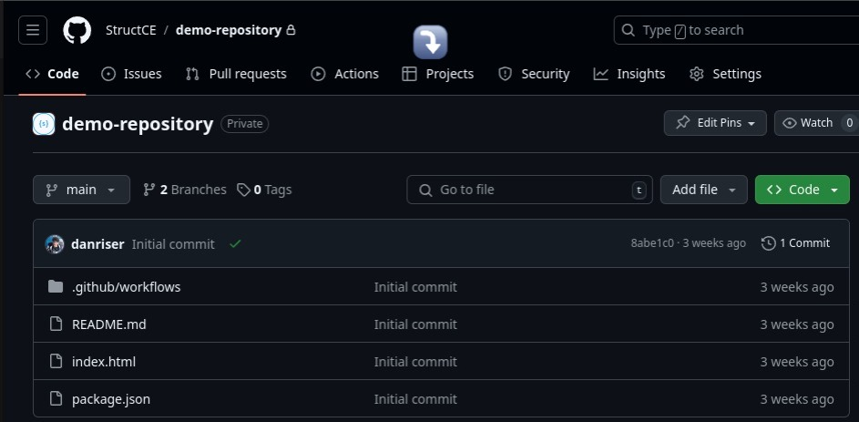
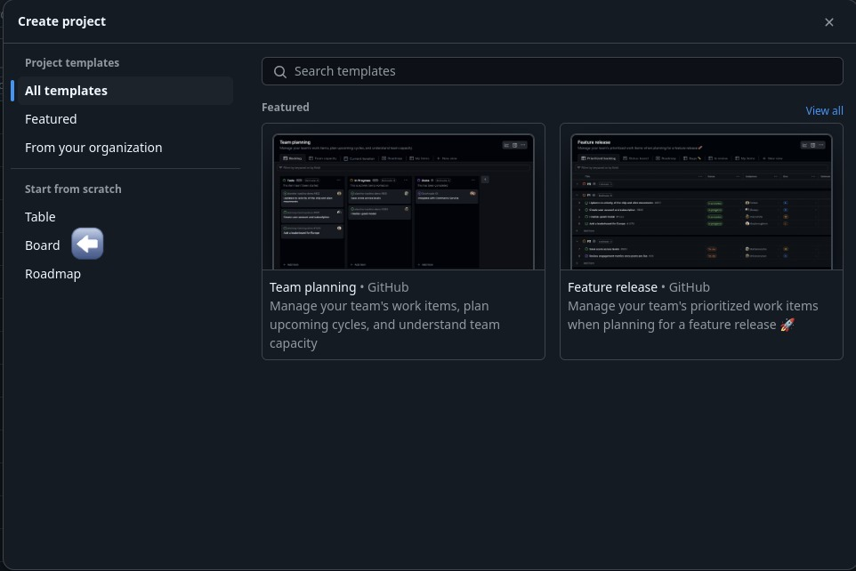
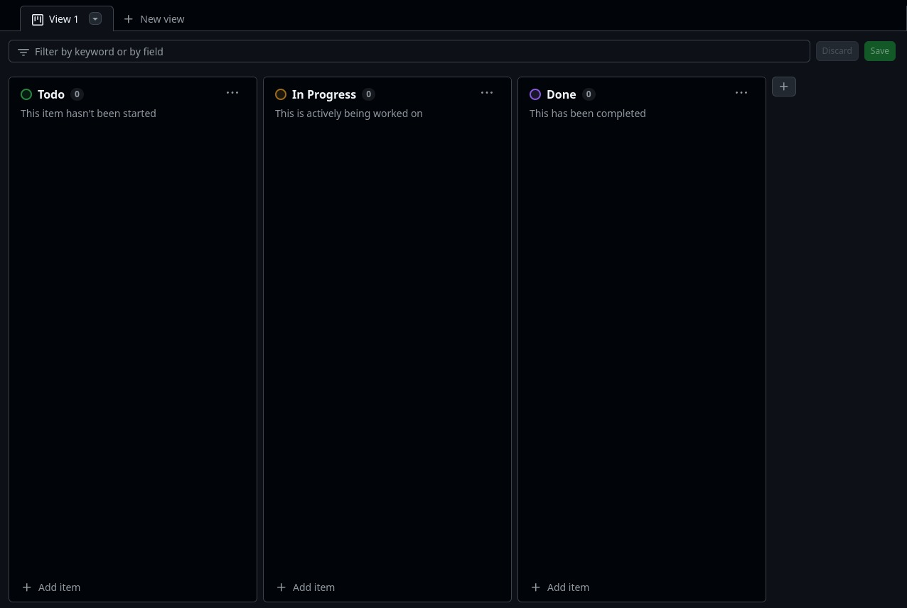
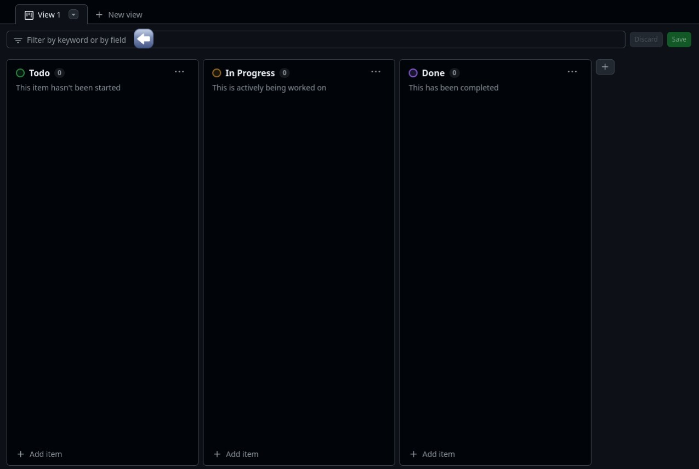

# Metodologias Ágeis

O objetivo desta etapa é apresentar as metodologias que a empresa utiliza para otimizar o processo de desenvolvimento.

## Scrum

O Scrum é uma metodologia ágil focada em entregar resultados de forma rápida e eficiente. A metodologia foi criada para promover a colaboração entre equipes, tornando o processo mais flexível e adaptável a mudanças.

### Principais Componentes do Scrum:

#### Papel do Gerente:

No caso da gerência do projeto, o gerente faz o papel tanto do Product Owner quanto do Scrum Master:

- Product Owner (Dono do Produto): responsável por definir a visão do produto e priorizar o backlog (lista de tarefas). O Product Owner deve garantir que a equipe está trabalhando nas funcionalidades de maior valor.
- Scrum Master: facilita a aplicação do Scrum, ajudando a equipe a seguir os princípios e removendo obstáculos que possam interferir no progresso.

#### Palavras populares no Scrum:

- Sprint: ciclo de desenvolvimento, onde geralmente e divido em 1 ou 2 semanas, no qual a equipe se compromete a entregar um incremento do produto. Durante esse período, o escopo não deve mudar.
- Product Backlog: Lista feita pelo gerente no início do projeto onde dá ordem e prioriza as funcionalidades e melhorias que devem ser feitas no projeto.
- Sprint Backlog: Lista de entregas que a equipe deve realizar durante uma Sprint (ciclo de trabalho). Elas são selecionadas do Product Backlog.
- Versões: É o produto final, ou uma parte funcional dele, entregue em cada Sprint. Essas versões devem estar em um estado utilizável (Ex: prototipação/figma, banco de dados, front-end).

#### Weekly Scrum:

O Weekly Scrum é uma reunião semanal de média duração (30 minutos) onde a equipe discute o que foi feito no decorrer da semana, o que será feito em seguida e se há impedimentos (Tradicionalmente, essa reunião é feita todos os dias, mas dentro da empresa nós fazemos semanalmente).

- Sprint Planning: Etapa no início de cada Sprint, onde a equipe planeja quais itens do Product Backlog serão trabalhados.
- Sprint Review: Etapa no final da Sprint, onde a equipe apresenta o que foi desenvolvido.
- Sprint Retrospective: Reunião para a equipe refletir sobre o processo da Sprint, identificando pontos de melhoria (essa reunião pode ser também um tópico feito no final da reunião semanal).

### Vantagens do Scrum:

- Flexibilidade: o Scrum permite mudanças de direção conforme novas informações ou requisitos surgem.
- Transparência: todos os envolvidos no projeto têm visibilidade sobre o progresso e as dificuldades.
- Entrega Rápida: como o trabalho é dividido em sprints, há entregas frequentes e incrementais, gerando valor mais rapidamente.
- Colaboração: promove a comunicação constante entre todos os membros da equipe.

#### Ciclo de Trabalho no Scrum:

O gerente faz o Backlog e a Sprint Planning, decidindo quais tarefas serão realizadas.
Durante a Sprint, a equipe faz reuniões para ajustar o trabalho.
No final da Sprint, ocorre uma revisão e o incremento é entregue.
A equipe faz a Sprint Retrospective para melhorar o processo na próxima Sprint.

## Kanban

A metodologia Kanban é uma abordagem ágil usada para gerenciar e otimizar o fluxo de trabalho de maneira visual, permitindo que as equipes acompanhem e melhorem seus processos continuamente. Originária do Japão e popularizada pela Toyota na produção industrial, a metodologia Kanban foi adaptada para gerenciamento de projetos.

### Princípios Fundamentais do Kanban:

#### Visualizar o Trabalho:

O princípio mais conhecido do Kanban é a visualização das tarefas em um quadro, geralmente chamado de "Kanban Board". Cada tarefa ou trabalho é representado por um cartão que é movido através de colunas que representam diferentes fases do processo (por exemplo: "A Fazer", "Em Progresso", "Concluído").
Isso permite que todos na equipe vejam claramente o status de cada tarefa e o progresso geral do projeto.

#### Limitar o Trabalho em Progresso (WIP - Work in Progress):

Um dos pilares do Kanban é limitar a quantidade de trabalho em andamento em cada fase. Isso ajuda a equipe a se concentrar em concluir as tarefas antes de começar novas, evitando que se dispersem em muitas atividades ao mesmo tempo.
Limitar o WIP também reduz o risco de sobrecarga e promove uma entrega mais eficiente.

#### Gerenciar o Fluxo de Trabalho:

O objetivo do Kanban é melhorar continuamente o fluxo de trabalho. Isso significa garantir que as tarefas passem por cada etapa do processo de maneira constante e sem gargalos.
Equipes podem medir o tempo que uma tarefa leva para ser concluída (Lead Time) e trabalhar para reduzir atrasos.

### Estrutura de um Quadro Kanban:

Um quadro Kanban típico tem colunas que representam o estado do trabalho. As colunas mais comuns incluem:

- Backlog: onde as tarefas a serem feitas são listadas.
- A Fazer: as tarefas que estão prontas para começar.
- Em Progresso: tarefas em andamento.
- Concluído: tarefas que foram finalizadas.

As equipes podem adicionar colunas intermediárias ou especializadas, como Revisão ou Teste, dependendo da natureza do trabalho.

### Limitação do Trabalho em Progresso:

O número de tarefas que podem estar na coluna Em Progresso é limitado. Isso ajuda a equipe a se concentrar nas tarefas que estão em andamento e a finalizá-las antes de começar novas.
Acompanhamento e Ajustes:

A equipe monitora o fluxo de trabalho e, se notar gargalos (por exemplo, muitas tarefas paradas em uma coluna), busca ajustar o processo para melhorar o fluxo. Isso pode ser feito, por exemplo, redistribuindo tarefas ou ajustando limites de WIP.

O Kanban é ideal para equipes que precisam de flexibilidade, visibilidade e querem melhorar continuamente a maneira como trabalham.

## Ferramentas

Durante o desenvolvimento do projeto, o gerente pode utilizar algumas ferramentas que facilite a gestão da equipe e para aplicar a metodologia ágil (nesse ponto não existe limitações, qualquer ferramenta que auxilie no processo é bem vinda). Existem algumas ferramentas conhecidas que podem contribuir no projeto como: Google Tasks; Trello; Github; etc.

### Como utilizar o Kanban do Github

No GitHub, a funcionalidade de Kanban está integrada dentro da ferramenta de "Projects". Para configurar a ferramenta e usar um quadro Kanban em um repositório no GitHub, siga os seguintes passos:

#### Passos para usar o Kanban no GitHub:

1. Acesse seu repositório no GitHub:

   - Entre no repositório onde deseja usar o Kanban.
   - Certifique-se de estar logado com permissões de escrita no repositório.

2. Vá para a aba de "Projects":

   - Dentro do repositório, clique na aba "Projects". Essa aba está na parte superior, junto com "Code", "Issues", "Pull Requests" etc.
     :::Acessando área de projetos
     
     :::
   - Se ainda não houver nenhum projeto, será exibida uma opção para criar um novo.

3. Crie um novo Projeto (Project):

   - Clique no botão "New Project".
   - Escolha o tipo de projeto Kanban (Board). O GitHub oferece diferentes formas de visualizar projetos, mas para o Kanban, você deve selecionar "Board".
     :::Criando o Kanban
     
     :::
   - Dê um nome para o seu projeto e adicione uma breve descrição (opcional).
   - Clique em "Create project" para criar seu novo quadro Kanban.

4. Configuração inicial do Kanban: O GitHub fornece algumas colunas padrão, que são:

   - To do: Tarefas que ainda não foram iniciadas.
   - In progress: Tarefas que estão em andamento.
   - Done: Tarefas que já foram concluídas.
     :::Kanban padrão do Github
     
     :::

   Você pode editar, adicionar ou remover colunas de acordo com a necessidade do seu projeto. Para editar uma coluna, clique nos três pontos no topo da coluna e selecione as opções disponíveis.

5. Adicionando cartões (cards):

   - Dentro de cada coluna, você pode adicionar "cards" para representar as tarefas ou funcionalidades a serem desenvolvidas.
   - Clique em "Add a card" dentro de uma coluna e selecione uma Issue existente do seu repositório, ou crie uma nova.
   - Se você quiser criar uma nova issue diretamente do quadro Kanban, clique em "Create new issue", escreva o título e, opcionalmente, adicione uma descrição.

6. Movendo tarefas entre colunas:

   - À medida que o trabalho avança, você pode arrastar e soltar os cartões de uma coluna para outra, por exemplo, de To do para In progress e depois para Done.

   Isso ajuda a visualizar o progresso de cada tarefa de maneira fácil e organizada.

7. Automatizando o fluxo de trabalho (opcional): O GitHub Projects permite automatizar certas ações, como mover cartões automaticamente para a coluna Done quando uma Pull Request é fechada. Para configurar isso:

   - Clique nos três pontos na parte superior da coluna desejada e selecione Manage automation.
   - Você pode definir gatilhos, como quando uma Issue for fechada ou quando um Pull Request for mergeado.

8. Visualizando e filtrando tarefas:

   - Na parte superior do projeto Kanban, há um botão de Filters onde você pode filtrar os cartões por assignee (responsável), label (etiquetas), milestones ou outras condições.
   - Isso ajuda a focar nas tarefas relevantes para um colaborador específico ou uma sprint.
     :::Selecionando filtros
     
     :::

9. Usando o quadro Kanban em equipe:
   - Você pode colaborar com sua equipe no quadro, atribuindo responsáveis para os cartões (issues) e adicionando labels para categorizar melhor as tarefas.
   - Também é possível comentar nas issues diretamente do quadro para facilitar a comunicação entre os membros do projeto.

#### Exemplos de uso:

- **Projetos Ágeis:** Configure colunas que representam fases do ciclo de desenvolvimento, como Backlog, Sprint, Em desenvolvimento, Revisão de código e Concluído.
- **Gestão de bugs:** Crie um quadro para priorizar e gerenciar correções de bugs com colunas como Aguardando correção, Em correção e Corrigido.

> **Dicas**
>
> - Use Labels e Milestones para organizar melhor o seu trabalho. As Labels podem categorizar as issues (ex: "Bug", "Feature", "Enhancement"), enquanto os Milestones ajudam a agrupar issues para uma entrega específica.
> - Revise periodicamente o quadro para garantir que as tarefas estejam sendo movidas corretamente e que o progresso do projeto seja transparente para todos os membros.
