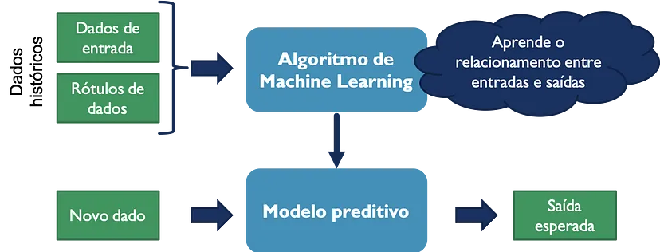
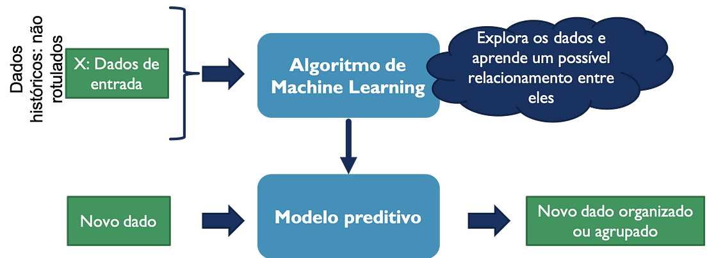

## Classificação
Cada tipo de aprendizado é adequado para diferentes tipos de problemas e cenários, e entender as diferenças entre eles é fundamental para escolher a abordagem correta em um projeto de machine learning. Neste artigo, vamos explorar cada tipo de aprendizado, discutindo seus princípios básicos, aplicações comuns e desafios associados.

Existem 3 categorias principais em que os algoritmos de machine learning pode ser classificados:

### Aprendizado Supervisionado
O aprendizado supervisionado, também conhecido como machine learning supervisionado, é definido pelo uso de conjuntos de dados rotulados para treinar algoritmos que classificam dados ou predizem resultados com precisão. Conforme os dados de entrada são alimentados no modelo, ele ajusta suas pontuações até que esteja ajustado de maneira adequada. Isso ocorre como parte do processo de validação cruzada para garantir que o modelo evita super ajuste ou subajuste. O aprendizado supervisionado ajuda as organizações a resolver uma variedade de problemas do mundo real em grande escala, como a classificação de spam em uma pasta separada da sua caixa de entrada. Alguns métodos usados na aprendizagem supervisionada incluem redes neurais, naïve bayes, regressão linear, regressão logística, floresta aleatória e máquina de vetores de suporte (SVM).

### Aprendizado Não-Supervisionado
O aprendizado não supervisionado, também conhecido como machine learning não supervisionado, usa algoritmos de machine learning para analisar e agrupar conjuntos de dados não rotulados. Esses algoritmos descobrem padrões ocultos ou agrupamentos de dados sem a necessidade de intervenção humana. A capacidade deste método de descobrir semelhanças e diferenças nas informações o torna ideal para análise exploratória de dados, estratégias de vendas cruzadas, segmentação de clientes, imagem e reconhecimento de padrões.

### Aprendizado por Reforço
O aprendizado por reforço é um paradigma em que um agente interage com um ambiente e aprende a tomar decisões sequenciais para maximizar uma recompensa cumulativa ao longo do tempo.
O objetivo é aprender uma política (estratégia) que permita ao agente tomar ações que otimizem sua recompensa ao longo de múltiplas etapas de decisão. Por exemplo, Jogos (como xadrez ou Go), robótica autônoma, navegação de veículos autônomos, controle de sistemas dinâmicos etc.
