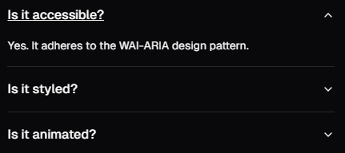
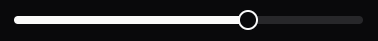

#

!!!info Documentação
Os exemplos a seguir são de alguns dos principais componentes do shadcn, eles foram tirados da [documentação oficial](https://ui.shadcn.com/docs), que possui muitos exemplos a mais. Leia a documentação!
Lembrando que podemos adicionar componentes tanto por meio da CLI quanto copiando e colando o código.
!!!

# Accordion

```bash
npx shadcn-ui@latest add accordion
```

Adicione o componente em alguma página sua:

```typescript
import {
  Accordion,
  AccordionContent,
  AccordionItem,
  AccordionTrigger,
} from '@/components/ui/accordion';

export function AccordionDemo() {
  return (
    <Accordion type="single" collapsible className="w-full">
      <AccordionItem value="item-1">
        <AccordionTrigger>Is it accessible?</AccordionTrigger>
        <AccordionContent>
          Yes. It adheres to the WAI-ARIA design pattern.
        </AccordionContent>
      </AccordionItem>
      <AccordionItem value="item-2">
        <AccordionTrigger>Is it styled?</AccordionTrigger>
        <AccordionContent>
          Yes. It comes with default styles that matches the other
          components&apos; aesthetic.
        </AccordionContent>
      </AccordionItem>
      <AccordionItem value="item-3">
        <AccordionTrigger>Is it animated?</AccordionTrigger>
        <AccordionContent>
          Yes. It&apos;s animated by default, but you can disable it if you
          prefer.
        </AccordionContent>
      </AccordionItem>
    </Accordion>
  );
}
```



# Carousel + Card

Adicione o arquivo do componente:

```bash
npx shadcn-ui@latest add carousel
npx shadcn-ui@latest add card
```

Adicione o componente em alguma página sua:

```typescript
import { Card, CardContent } from '@/components/ui/card';
import {
  Carousel,
  CarouselContent,
  CarouselItem,
  CarouselNext,
  CarouselPrevious,
} from '@/components/ui/carousel';

export function CarouselDemo() {
  return (
    <Carousel className="w-full max-w-xs">
      <CarouselContent>
        {Array.from({ length: 5 }).map((_, index) => (
          <CarouselItem key={index}>
            <div className="p-1">
              <Card>
                <CardContent className="flex aspect-square items-center justify-center p-6">
                  <span className="text-4xl font-semibold">{index + 1}</span>
                </CardContent>
              </Card>
            </div>
          </CarouselItem>
        ))}
      </CarouselContent>
      <CarouselPrevious />
      <CarouselNext />
    </Carousel>
  );
}
```


# Input

Adicione o arquivo do componente:

```bash
npx shadcn-ui@latest add input
```

Adicione o componente em alguma página sua:

```typescript
import { Input } from '@/components/ui/input';

export function InputDemo() {
  return <Input type="email" placeholder="Email" />;
}
```


# Select

Adicione o arquivo do componente:

```bash
npx shadcn-ui@latest add select
```

Adicione o componente em alguma página sua:

```typescript
import {
  Select,
  SelectContent,
  SelectGroup,
  SelectItem,
  SelectLabel,
  SelectTrigger,
  SelectValue,
} from '@/components/ui/select';

export function SelectDemo() {
  return (
    <Select>
      <SelectTrigger className="w-[180px]">
        <SelectValue placeholder="Select a fruit" />
      </SelectTrigger>
      <SelectContent>
        <SelectGroup>
          <SelectLabel>Fruits</SelectLabel>
          <SelectItem value="apple">Apple</SelectItem>
          <SelectItem value="banana">Banana</SelectItem>
          <SelectItem value="blueberry">Blueberry</SelectItem>
          <SelectItem value="grapes">Grapes</SelectItem>
          <SelectItem value="pineapple">Pineapple</SelectItem>
        </SelectGroup>
      </SelectContent>
    </Select>
  );
}
```


# Slider

Adicione o arquivo do componente:

```bash
npx shadcn-ui@latest add slider
```

Adicione o componente em alguma página sua:

```typescript
import { cn } from '@/lib/utils';
import { Slider } from '@/components/ui/slider';

type SliderProps = React.ComponentProps<typeof Slider>;

export function SliderDemo({ className, ...props }: SliderProps) {
  return (
    <Slider
      defaultValue={[50]}
      max={100}
      step={1}
      className={cn('w-[60%]', className)}
      {...props}
    />
  );
}
```



# Textarea

Adicione o arquivo do componente:

```bash
npx shadcn-ui@latest add textarea
```

Adicione o componente em alguma página sua:

```typescript
import { Textarea } from '@/components/ui/textarea';

export function TextareaDemo() {
  return <Textarea placeholder="Type your message here." />;
}
```


# Toast

Adicione o arquivo do componente:

```bash
npx shadcn-ui@latest add toast
```

Adicione o componente em alguma página sua:

```typescript
import { Button } from '@/components/ui/button';
import { useToast } from '@/components/ui/use-toast';

export function ToastSimple() {
  const { toast } = useToast();

  return (
    <Button
      variant="outline"
      onClick={() => {
        toast({
          description: 'Your message has been sent.',
        });
      }}
    >
      Show Toast
    </Button>
  );
}
```


# Tabs (Abas)

Adicione o arquivo do componente:

```bash
npx shadcn-ui@latest add tabs
```

Adicione o componente em alguma página sua:

```typescript
import { Tabs, TabsContent, TabsList, TabsTrigger } from '@/components/ui/tabs';

export default function Home() {
  return (
    <Tabs defaultValue="account" className="w-[400px]">
      <TabsList>
        <TabsTrigger value="account">Account</TabsTrigger>
        <TabsTrigger value="password">Password</TabsTrigger>
      </TabsList>
      <TabsContent value="account">
        Make changes to your account here.
      </TabsContent>
      <TabsContent value="password">Change your password here.</TabsContent>
    </Tabs>
  );
}
```


# Label + Radio Group

```bash
npx shadcn-ui@latest add label
npx shadcn-ui@latest add radio-group
```

```typescript
import { Label } from '@/components/ui/label';
import { RadioGroup, RadioGroupItem } from '@/components/ui/radio-group';

export default function Page() {
  return (
    <RadioGroup defaultValue="option-one">
      <div className="flex items-center space-x-2">
        <RadioGroupItem value="option-one" id="option-one" />
        <Label htmlFor="option-one"> Default </Label>
      </div>
      <div className="flex items-center space-x-2">
        <RadioGroupItem value="option-two" id="option-two" />
        <Label htmlFor="option-two"> Comfortable </Label>
      </div>
      <div>
        <RadioGroupItem value="option-three" id="option-three" />
        <Label htmlFor="option-three"> Compact </Label>
      </div>
    </RadioGroup>
  );
}
```


