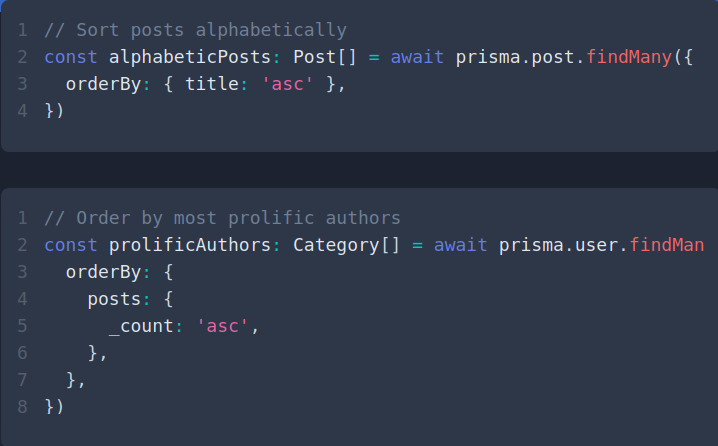

## O que é ORM ?

<!-- Trecho feito por Araújo -->

ORM, ou Mapeamento Objeto-Relacional, é uma técnica de programação que permite que os desenvolvedores de software interajam com bancos de dados relacionais usando objetos e classes no lugar de consultas SQL diretas. A ideia principal por trás do ORM é eliminar a necessidade de escrever consultas SQL manualmente e simplificar a interação entre o código da aplicação e o banco de dados relacional. Em vez de tratar as tabelas e registros do banco de dados como entidades separadas e escrever SQL para buscar, inserir, atualizar ou excluir dados, os desenvolvedores podem trabalhar com objetos em código que representam diretamente os dados do banco de dados. O ORM mapeia esses objetos para tabelas do banco de dados e vice-versa.

## O que é Prisma?

O [prisma](https://www.prisma.io) é uma biblioteca desenvolvida em TypeScript, que tem suporte para ser usada nas linguagens .js/.ts. Ela possui diferentes módulos, entre eles estão:

- Prisma db/migrate (Instalado com o CLI);
- Prisma Studio (Instalado com o CLI);
- Prisma Client (Instalado separadamente como client);

A ideia do Prisma é ser uma ORM. Ela pode ser utilizada no desenvolvimento de aplicações em JavaScript ou TypeScript, que necessitem de alguma estrutura de banco de dados. Ela é bem **amigável com iniciantes** - devido à sintaxe de fácil entendimento e à facilidade de construção das models - e **permite segurança de tipos**. **É ruim** em questão de **performance**, mas a gente nunca precisou de performance (pelo menos por enquanto).

==- Conte-me mais

O Prisma **esconde** a implementação em **SQL** das queries. Mostra pro usuário da **biblioteca** uma interface construída em TypeScript, o que significa que tem **autocomplete e segurança de tipos na** sua **utilização**. Também fornece funções de **filtragem** e **ordenação** de **fácil** utilização.

É **nessa parte** que o Prisma **se destaca** em relação às alternativas.

Essa abstração também fornece **segurança de tipos** pra sua **API** e **frontend** (caso use os tipos exportados pelo Prisma). Isso **significa** que, caso **altere** alguma **model**, os **tipos do Prisma** também **mudarão**, e o VSCode e ferramenta de verificação de código estático te **alertarão** caso esteja acessando algo que o banco de dados não retorna mais. Isso também fornece autocomplete na utilização das instâncias das models.

**Outras bibliotecas** em TypeScript **também** fornecem essa última parte (**segurança de tipos**), **mas** possuem uma abstração e **sintaxe** mais **próxima do SQL**, dificultando entrada do iniciante/atrasando o desenvolvimento.

Considere a sintaxe do Kysely por exemplo:

===

!!!warning Performance
Caso performance para _queries_ mais complexas seja uma preocupação do projeto, veja a situação atual do Prisma ao lidar com joins (é um problema atualmente, em 2023).

Considere usar outra solução, como [kisley](https://github.com/kysely-org/kysely), [drizzle](https://orm.drizzle.team/docs/sql-schema-declaration). Dependendo do cliente, até terceirizar e usar [Planetscale](https://planetscale.com/), [Turso](https://turso.tech/), etc.
!!!

### Prisma

O _core_ dessa biblioteca é o pacote `prisma`, que **permite que** você **se conecte a um banco de dados e construa ou altere o seu schema**, ou seja, construa ou altere a modelagem das entidades que seu banco de dados implementa. Por padrão ele usa o arquivo em `prisma/schema.prisma` como base para atualizar o schema do banco de dados, e necessita de uma variável de ambiente para localizar o banco de dados a ser alterado pelos comandos.

É um pacote adicionado como **dependência de desenvolvedor**, pois é uma ferramenta CLI (Command Line Interface), e **não é executada por** nenhum **código** do programa.

!!! Fazendo deploy?

Talvez ce tenha que usar o Prisma CLI dentro do container pra fazer o schema do banco de dados de lá ser alterado. Vale a pena criar um script de inicialização pra isso, mas ainda não existe.

!!!

### Prisma Client

O cliente Prisma, pacote `@prisma/client`, **permite usar código para ler e alterar as informações do banco de dados**. Basta instanciar o cliente e fazer as chamadas para encontrar ou criar novos registros no banco de dados.

### Prisma studio

É um adicional do Prisma, que **permite ver e alterar o estado do banco de dados por interface gráfica**. Ele pode ser usado mesmo que Prisma não esteja sendo usado no projeto. Basta passar a url de conexão do banco de dados e _tadan_, interface gráfica.
