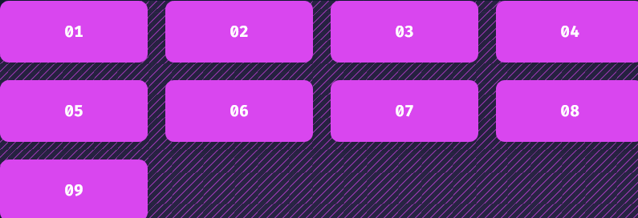
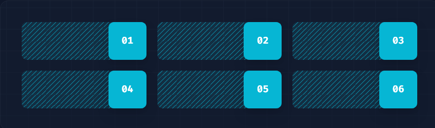
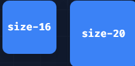
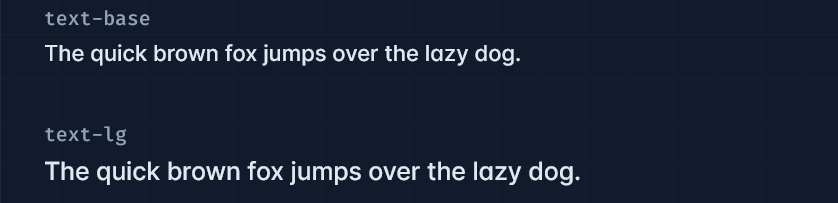
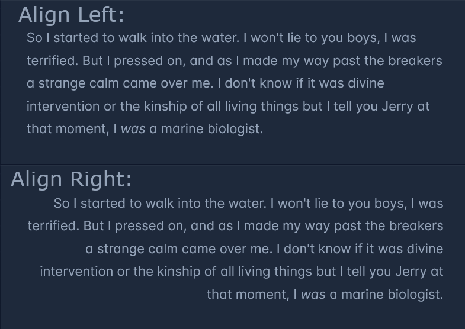
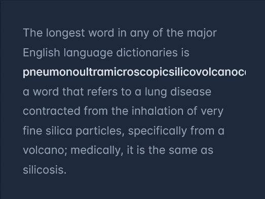
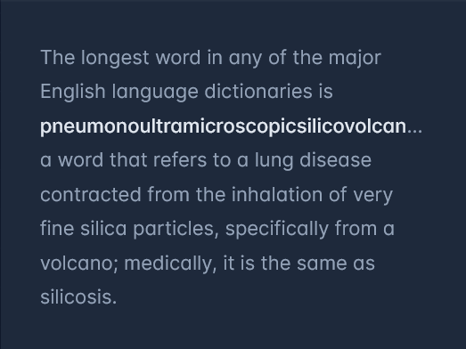

# Utilizando Tailwind Em Seus Projetos

Essa página contém alguns exemplos de uso de Tailwind, mostrando algumas classes úteis e comuns.
Todos os exemplos podem ser encontrados [na documentação oficial](https://tailwindcss.com/docs/installation) (dê uma olhada na aba a esquerda da tela).

## Cores Pré-Definidas

[Tailwind conta com cores já definidas](https://tailwindcss.com/docs/customizing-colors) para utilizarmos em componentes. Como mencionado na seção de Instalação - [!ref Instalando Tailwind e CSS no Next](./instalacao.md), podemos obter um *auto-complete* por meio da extensão [Tailwind CSS IntelliSense](https://marketplace.visualstudio.com/items?itemName=bradlc.vscode-tailwindcss) para VSCode, o que facilita verificar quais cores estão disponíveis para uso.

Por padrão, Tailwind utiliza uma convenção para nomenclatura de suas cores: o nome da cor em si (red, green, etc.) seguido por uma escala numérica, onde 50 indica que a cor é clara e 900 que é escura.

A utilização dessas cores aparecem em várias classes diferentes do Tailwind, como em [textos](https://tailwindcss.com/docs/text-color), [cor do background](https://tailwindcss.com/docs/background-color), [de uma borda](https://tailwindcss.com/docs/border-color), etc. A sintaxe muda um pouco dependendo do componente utilizado, mas a convenção de nome das cores em si continua a mesma.

Como exemplo:

```html
<button class="bg-indigo-500 ...">
  Save changes
</button>
```


## Valores Arbitrários

É possível utilizar um valor que não esteja disponível por padrão no Tailwind.

Vários componentes do Tailwind seguem a definição de sintaxe explicada acima. Assim como para cores, valores pré-definidos são usados para definir posição de elementos, como `top-0`, largura (`w-80`), altura (`h-80`), etc.

Mas caso você precise utilizar um [valor customizado apenas uma vez dentro de uma classe](https://tailwindcss.com/docs/adding-custom-styles#using-arbitrary-values), Tailwind permite utilizar a sintaxe `classe-[valor]`, onde o valor que você quer utilizar aparece dentro dos colchetes. Por exemplo,

```html
<div class="top-[117px]">
  <!-- ... -->
</div>
```

Aqui, `top-[117px]` define o alinhamento no topo da página desse elemento, utilizando um valor não definido pelo Tailwind.

## Customização com `tailwind.config.ts`

Também é possível definir valores customizados que ficam disponível e perduram por toda a sua aplicação.

O arquivo `tailwind.config.ts` é onde podemos definir customizações de todos os tipos para utilizar no Tailwind. Por exemplo, podemos [substituir as paleta de cores padrão](https://tailwindcss.com/docs/customizing-colors#using-custom-colors):

```ts tailwind.config.ts
import type { Config } from "tailwindcss";

module.exports = {
  theme: {
    colors: {
      transparent: 'transparent',
      current: 'currentColor',
      'white': '#ffffff',
      'purple': '#3f3cbb',
      'midnight': '#121063',
      'metal': '#565584',
      'tahiti': '#3ab7bf',
      'silver': '#ecebff',
      'bubble-gum': '#ff77e9',
      'bermuda': '#78dcca',
    },
  },
};
export default config;
```

E, depois, utilizá-las em qualquer lugar que use cores:

```html
<div class="bg-midnight text-tahiti">
  <!-- ... -->
</div>
```

É possível, também, adicionar uma cor à paleta do Tailwind:

```ts tailwind.config.ts
import type { Config } from "tailwindcss";

module.exports = {
  theme: {
    extend: {
      colors: {
        brown: {
          50: '#fdf8f6',
          100: '#f2e8e5',
          200: '#eaddd7',
          300: '#e0cec7',
          400: '#d2bab0',
          500: '#bfa094',
          600: '#a18072',
          700: '#977669',
          800: '#846358',
          900: '#43302b',
        },
      }
    },
  },
};
export default config;
```

O arquivo `tailwind.config.ts` permite definir várias customizações além das mostradas aqui. Em várias partes da documentação é possível achar exemplos de como fazer isso.

## Display

As [classes de display](https://tailwindcss.com/docs/display) do Tailwind permitem controlar a forma como um elemento será exibido, muitas vezes em relação a outros elementos.

### Flexbox

Tailwind possui classes que permitem definir o comportamento de elementos HTML com a propriedade *flex* (*flexible*), ou seja, definir posicionamento, tamanho, etc.

[*Flex*](https://tailwindcss.com/docs/flex) possui propriedades que permitem alterar como um elemento muda de tamanho. Suas classes e definições em CSS são

Nome da Classe   | Definição em CSS
---              | ---
`flex-1`         | `flex: 1 1 0%;`
`flex-auto`      | `flex: 1 1 auto;`
`flex-initial`   | `flex: 0 1 auto;`
`flex-none`      | `flex: none;`

[A documentação](https://tailwindcss.com/docs/flex) possui exemplos interativos de como essa propriedade age em um elemento.

### Grid

As propriedades [*Grid*](https://tailwindcss.com/docs/grid-template-columns) permitem especificar o comportamento e organização de elementos em um layout estilos *grid*. Como exemplo da documentação, os utilitários *Grid Template Columns*:

```html
<div class="grid grid-cols-4 gap-4">
  <div>01</div>
  <!-- ... -->
  <div>09</div>
</div>
```



Relacionada tanto a elementos flex quanto grid, [a propriedade *gap*](https://tailwindcss.com/docs/gap) permite definir o espaçamento entre os elementos. É possível controlar espaços verticais e horizontais separadamente ou ambos de uma vez.

```html Espaçamento Geral
<div class="grid gap-4 grid-cols-2">
  <div>01</div>
  <div>02</div>
  <div>03</div>
  <div>04</div>
</div>
```

```html Espaçamentos Vertical e Horizontal Separados
<div class="grid gap-x-8 gap-y-4 grid-cols-3">
  <div>01</div>
  <div>02</div>
  <div>03</div>
  <div>04</div>
  <div>05</div>
  <div>06</div>
</div>
```

### Justify

Tailwind possui alguns utilitários para controlar como os itens *flex* e *grid* são posicionados *horizontalmente* em relação a um contêiner.

Alguns exemplos das classes [`Justify Content`](https://tailwindcss.com/docs/justify-content) e [`Justify Items`](https://tailwindcss.com/docs/justify-items):

==- Justify Content

```html
<div class="flex justify-center ...">
  <div>01</div>
  <div>02</div>
  <div>03</div>
</div>
```


===

==- Justify Items

```html
<div class="grid justify-items-end ...">
  <div>01</div>
  <div>02</div>
  <div>03</div>
  <div>04</div>
  <div>05</div>
  <div>06</div>
</div>
```



===

### Align

De maneira similar a justify, Tailwind possui [classes de alinhamento](https://tailwindcss.com/docs/align-items) *vertical* de items, como `items-center`:

```html
<div class="flex items-center ...">
  <div class="py-4">01</div>
  <div class="py-12">02</div>
  <div class="py-8">03</div>
</div>
```


## Classes de Tamanho

Algumas classes permitem modificar o tamanho de um elemento.

Por exemplo, [**width**](https://tailwindcss.com/docs/width) altera a largura:

```html Valores pré-fixados de largura
<div class="w-96 ...">w-96</div>
<div class="w-80 ...">w-80</div>
```


Já o [**height**](https://tailwindcss.com/docs/height) permite alterar a altura:

```html
<div class="h-32 ...">h-32</div>
<div class="h-24 ...">h-24</div>
```


A classe [**size**](https://tailwindcss.com/docs/size) permite mudar a largura e altura de um elemento ao mesmo tempo:

```html
<div class="size-16 ...">size-16</div>
<div class="size-20 ...">size-20</div>
```



## Classes de Texto e Fontes

Tailwind possui várias classes que permitem alterar tamanho, cor, alinhamento, decoração e vários outros de texto, fonte e até da linha do texto. Algumas classe úteis são:

- [*Font Size*](https://tailwindcss.com/docs/font-size);
    ==- Text Font Size

    ```html
    <p class="text-base ...">The quick brown fox ...</p>
    <p class="text-lg ...">The quick brown fox ...</p>
    ```

    
    ==

- [*Text Align*](https://tailwindcss.com/docs/text-align);
    ==- Text Align

    ```html
    <p class="text-left ...">So I started to walk into the water...</p>
    <p class="text-right ...">So I started to walk into the water...</p>
    ```

    
    ==

- [*Text Color*](https://tailwindcss.com/docs/text-color);
    ==- Text Color

    ```html
    <p class="text-sky-400">The quick brown fox...</p>
    ```

    


- [*Text Overflow*](https://tailwindcss.com/docs/text-overflow);
    ==- Text Overflow
    +++ `text-clip`
    ```html
    <p class="text-clip overflow-hidden ...">...</p>
    ```
    
    +++ `text-ellipsis`
    ```html
    <p class="text-ellipsis overflow-hidden ...">...</p>
    ```
    
    +++ `truncate`
    ```html
    <p class="truncate ...">...</p>
    ```
    
    +++

## Background

Tailwind também possui vários utilitários para controlar como se comporta o background de um elemento, como

- [*Background Color*](https://tailwindcss.com/docs/background-color);
- [*Background Position*](https://tailwindcss.com/docs/background-position);
- [*Background Size*](https://tailwindcss.com/docs/background-size);
- [*Background Image*](https://tailwindcss.com/docs/background-image);

## Media Query

*Media Queries* "são um recurso do CSS 3 que permite que a renderização do conteúdo se adapte a diferentes condições, como a resolução da tela." [Tailwind possui modificadores para design responsivo](https://tailwindcss.com/docs/hover-focus-and-other-states#media-and-feature-queries) em cada uma de suas classes. Como no exemplo da documentação, "isso renderizará uma grid de 3 colunas em dispositivos móveis, uma de 4 colunas em telas de largura média (`md`) e uma grid de 6 colunas em telas de largura grande(`lg`):"

```html
<div class="grid grid-cols-3 md:grid-cols-4 lg:grid-cols-6">
  <!-- ... -->
</div>
```

Como outro exemplo, a [adição de imagens ao background](https://tailwindcss.com/docs/background-image#breakpoints-and-media-queries) - "Você também pode usar modificadores de variantes para direcionar media queries, como pontos de interrupção responsivos, modo escuro, preferência por movimento reduzido e muito mais.  Por exemplo, use `md:bg-gradient-to-r` para aplicar o utilitário `bg-gradient-to-r` apenas em tamanhos de tela médios e superiores."


```html
<div class="bg-gradient-to-l md:bg-gradient-to-r">
  <!-- ... -->
</div>
```

Nesse exemplo citado, as larguras `md` e `lg`, são usadas como larguras mínimas para a responsividade. Se quiser aplicar responsividade para larguras máximas deve-se usar `max-(tamanho):`.

!!!info
Tailwind possui [uma página dedicada a documentar design responsivo](https://tailwindcss.com/docs/responsive-design) utilizando suas classes.
!!!
